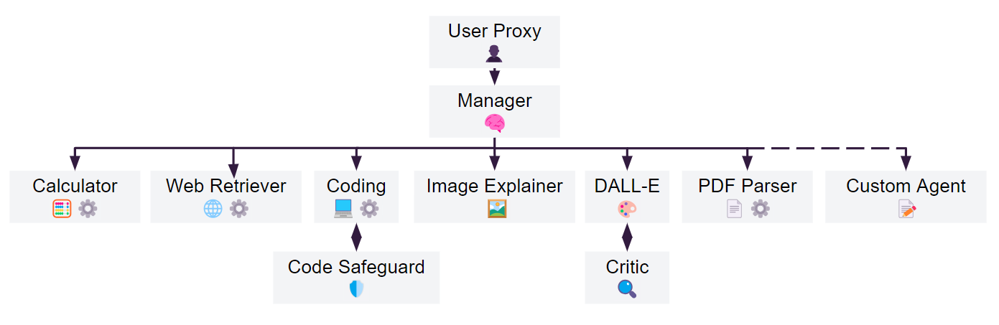
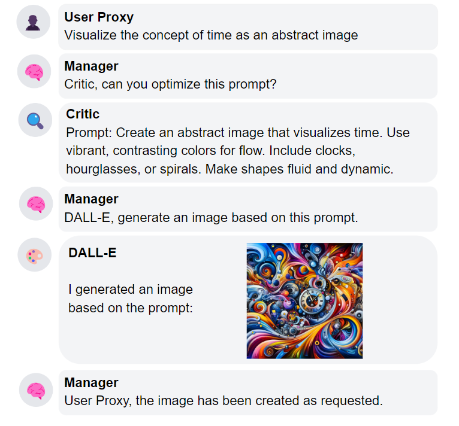
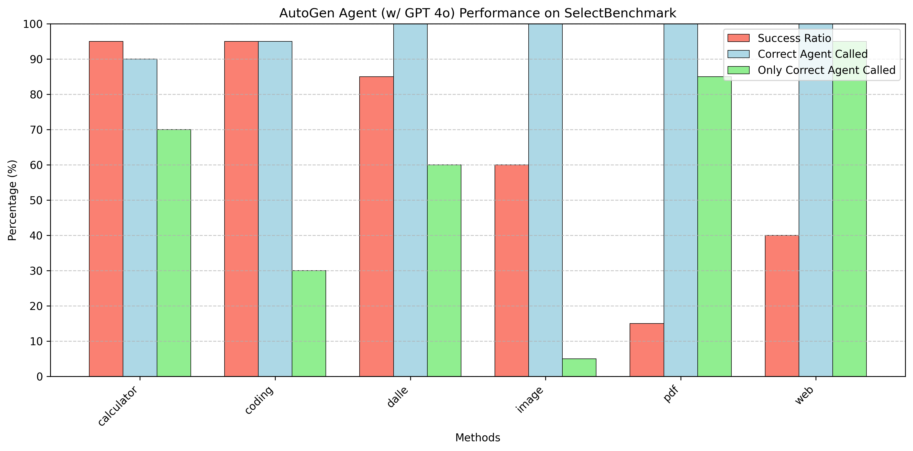
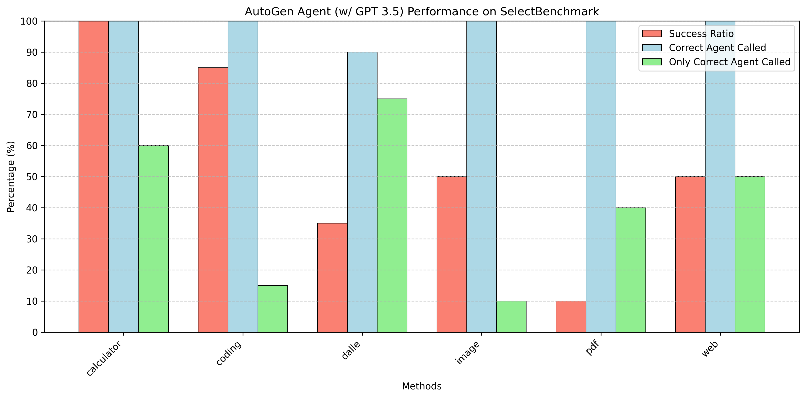
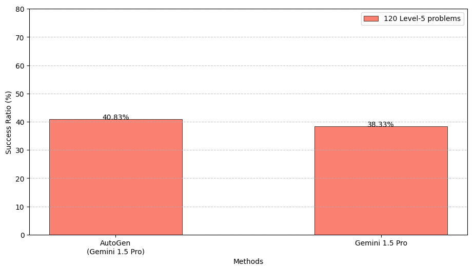
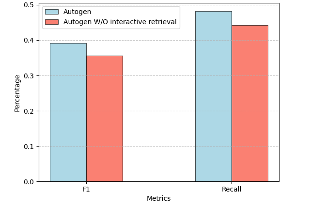
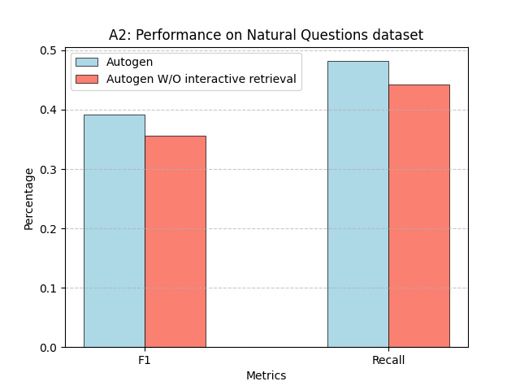
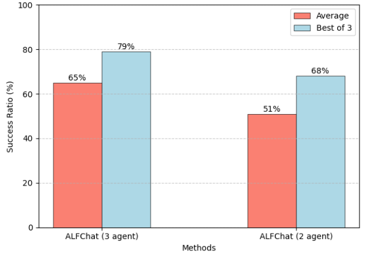
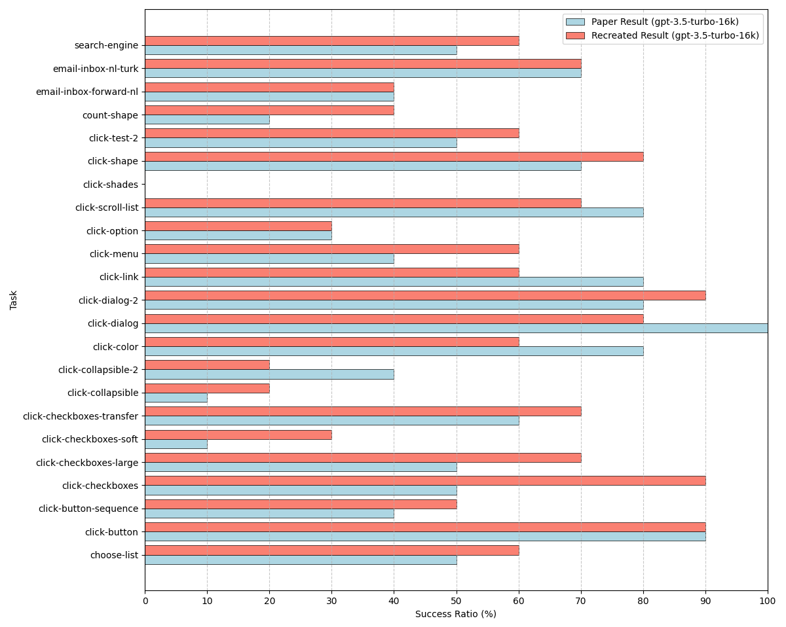
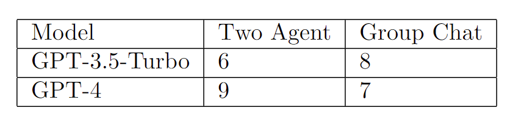

# Multi-Agent Large Language Models with AutoGen

This project was completed by Janik Jehkul, Nikita Kostin, and Xiangyu Ning under the supervision of Johann Hagerer as
a part of the NLP Lab course.

## Motivation

An agent is an entity acting on behalf of human intent, capable of conversation and interaction with other agents. 

Empirical studies demonstrate an advantage of a multi-agent setup over the traditional single-agent approach. This
project is based on the paper "Autogen: Enabling next-gen llm applications via multi-agent conversation framework." by
Wu, Qingyun, et al. and serves as a demonstration of such multi-agent approaches.

## Overarching Agent Architecture

The core of our multi-agent system is the overarching agent, which acts as a manager orchestrating the workflow. It receives the user's request and intelligently delegates the task to the most suitable specialized agent(s) from a predefined pool.

*Figure: Illustration of the overarching agent architecture, showing the flow from User Proxy to Manager and delegation to specialized agents.*

To illustrate this we provide an example of a sample chat between different agents.

*Figure: Example of an agent interaction/chat flow.*

## Overview

This project delves into the capabilities of multi-agent Large Language Model (LLM) systems, leveraging the **AutoGen framework** [AutoGen](https://arxiv.org/pdf/2308.08155)
. Our primary focus is on exploring and evaluating the effectiveness of an **overarching agent** architecture designed to delegate tasks to specialized sub-agents, thereby tackling complex problems across diverse domains (detailed in Section 3 of our accompanying paper).

The core contributions and activities of this project include:

1.  **Reproducing Foundational Experiments:** We systematically replicated key experiments presented in the original AutoGen paper to validate their findings and establish a performance baseline. These experiments cover areas such as:
    *   Mathematical problem-solving (MATH dataset)
    *   Retrieval-Augmented Generation (RAG) on the NaturalQuestions dataset
    *   Text-based world interaction (ALFWorld)
    *   Multi-agent coding challenges (OptiGuide dataset)
    *   Dynamic group chat simulations
    *   Conversational Chess
    *   Web interaction tasks (MiniWoB++)
    (Results corresponding to these replications are located in the `experiment_results` folder and visualized below).

2.  **Exploring Novel Applications:** We extended the AutoGen framework to new scenarios to demonstrate its versatility:
    *   **PDFTriage:** Parsing and querying information from PDF documents.
    *   **DALL-E Integration:** Generating images via text prompts using DALL-E 3, including a critic agent for prompt refinement.
    *   **Vision Capabilities:** Enabling the system to process and understand image inputs.
    *   **Interactive Browsing:** Equipping an agent with the ability to search the web and retrieve information from specific URLs.

3.  **Developing an Overarching Agent:** We designed and implemented a parent agent responsible for managing conversations, selecting appropriate specialized agents (like Calculator, Web Retriever, Coder, Image Explainer, DALL-E, PDF Parser, etc.), and managing the interaction flow based on the user's request.

4.  **Creating a Streamlit Showcase:** A user-friendly demonstration application was built using `Streamlit` to visualize the internal discussion process and interactions between agents for both standalone tasks and the overarching agent system.

5.  **Introducing `SelectBenchmark`:** We developed a novel benchmark specifically designed to evaluate the overarching agent's ability to correctly route tasks to the appropriate specialized agent and assess the overall success rate of task completion. This benchmark utilizes an LLM-as-evaluator approach for automated assessment across diverse task categories (calculator, coding, DALL·E, image retriever, pdf parser, web retriever).

The comprehensive results and analysis of these experiments are detailed in Section 6 of our paper.

## Project Activities Summary

As a part of this project we:

1.  Conducted the experiments presented in the original paper to reproduce the findings. Their results are located in the `experiment_results` folder.
2.  Explored further scenarios in which the multi-agent setup would be beneficial, such as PDF parsing or DALL-E image generation.
3.  Built a parent (overarching) agent to combine the standalone agents using a group chat for answering a broader range of questions.
4.  Developed a demo using the `Streamlit` Python library for showcasing the internal discussion process for both standalone agents and the parent agent.
5.  Created a custom `SelectBenchmark` for evaluating the frequency of the calls to correct agents and automated the evaluation process using the LLM-as-evaluator approach.

## Key Components

### SelectBenchmark

To quantitatively assess the performance of our overarching agent, we created `SelectBenchmark`. It comprises 120 tasks across 6 categories, designed to test task routing accuracy and success.

*Figure: Performance of the overarching agent on SelectBenchmark using the GPT-4o backbone.*

*Figure: Performance of the overarching agent on SelectBenchmark using the GPT-3.5 backbone.*

## Experiment Visualizations

Below are visualizations corresponding to some of the experiments conducted:

### MATH Dataset Performance

*Figure: Performance evaluation on the MATH dataset.*

### RAG Performance

*Figure: RAG Performance visualization.*

*Figure: Alternative RAG Performance visualization.*

*Figure: Another RAG Performance visualization.*

### ALFWorld Text World Interaction

*Figure: Results from the ALFWorld Text World Interaction benchmark.*

### MiniWoB++ Web Interaction

*Figure: Performance metrics on MiniWoB++ Web Interaction tasks.*

### Miscellaneous Visualizations

*Figure: Table visualization, potentially related to coding experiments or benchmark details.*

*Figure: Example of an agent interaction/chat flow.*

## Project Poster

A detailed overview of the project is also available in our final report:

[View Project Poster (PDF)](public/final-report.pdf)

## Future work

1. Integrate more agents into the parent agent flow.
2. Fine-tune the specialized agents to get better results for specific tasks.
3. Compare the performance of our agents with similar frameworks.
